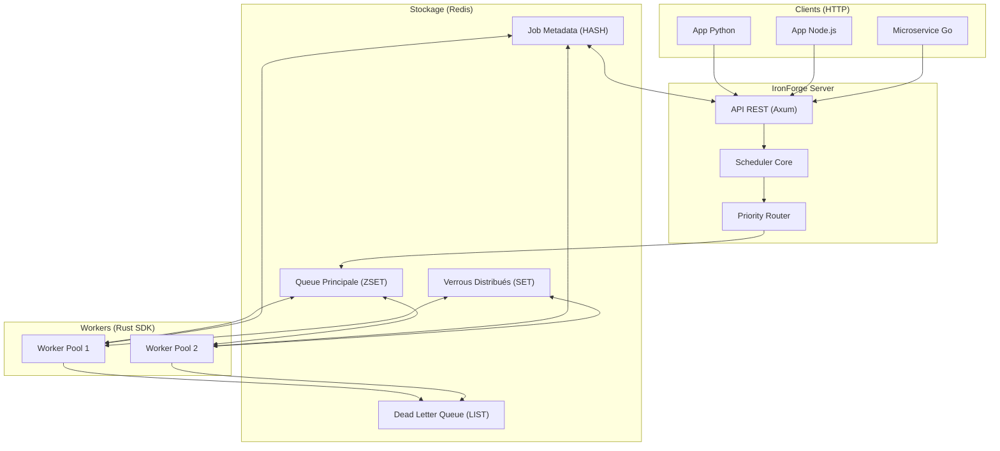
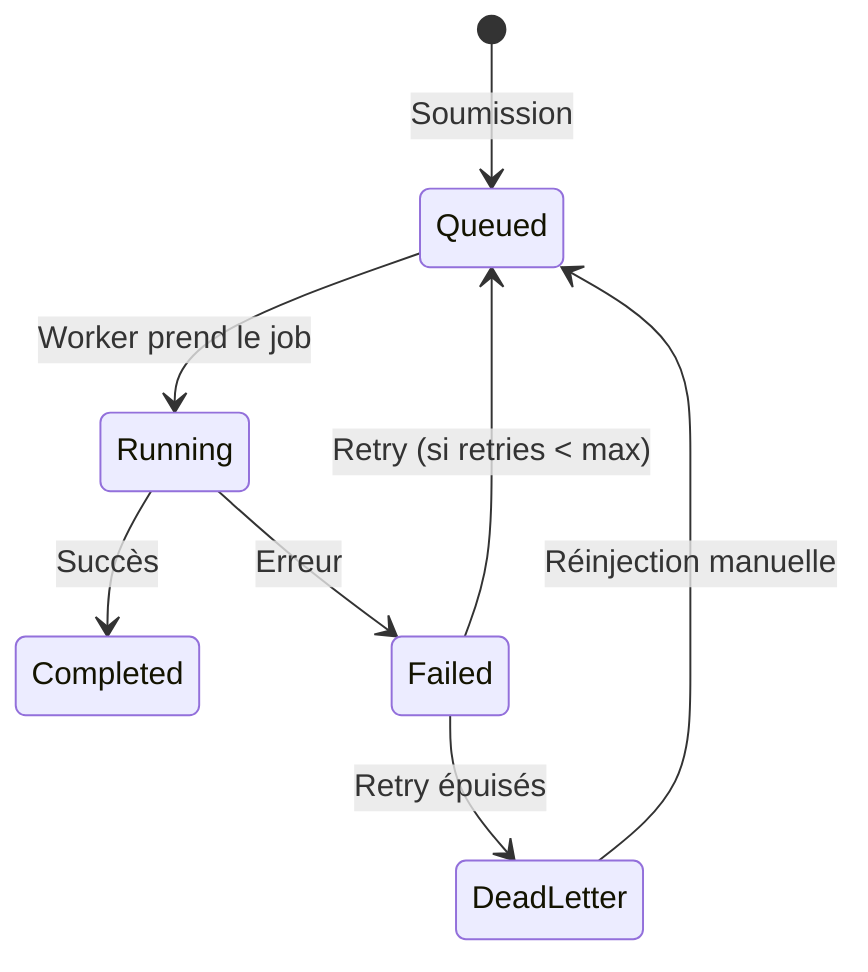

# 🔥 Plan d'Implémentation IronForge

> **IronForge** - Un planificateur de tâches distribué de haute performance écrit en Rust.

---

## 1. Objectif & Positionnement Marché

### Le Problème
Les solutions actuelles (Celery, BullMQ, Sidekiq) souffrent de :
| Problème | Impact |
|----------|--------|
| Consommation mémoire élevée | Coûts cloud x2-x5 |
| Dépendance au langage (Python/Ruby/Node) | Pas de polyglotte |
| Latence de déqueue | Retards en cascade |
| Gestion des erreurs basique | Jobs perdus |

### Notre Solution
**IronForge** : Un scheduler **polyglotte** (API HTTP), ultra-rapide (~100k jobs/sec), avec garantie de livraison "at-least-once" et consommation mémoire < 50MB par worker.

---

## 2. Architecture Système



---

## 3. Revue Utilisateur Requise

> [!IMPORTANT]
> **Choix Technique #1 : Backend Redis**
> Nous utilisons Redis (Sorted Sets) pour la v1. Avantages : atomicité, BLPOP, écosystème établi.
> Alternative future : Mode "embedded" avec Sled/Redb pour déploiement sans dépendance.

> [!WARNING]
> **Décision Requise : Garantie de Livraison**
> - **At-Least-Once** (recommandé) : Jobs réexécutés si timeout, nécessite idempotence côté handler.
> - **At-Most-Once** : Aucun retry, jobs potentiellement perdus.

---

## 4. Modèle de Données

### 4.1 Structure `Job`
```rust
pub struct Job {
    pub id: Uuid,              // Identifiant unique
    pub kind: String,          // Type de job (ex: "email.send")
    pub payload: Value,        // Données JSON arbitraires
    pub priority: Priority,    // Low, Medium, High, Critical
    pub status: JobStatus,
    pub max_retries: u8,
    pub retry_count: u8,
    pub created_at: DateTime<Utc>,
    pub scheduled_for: Option<DateTime<Utc>>,  // Jobs différés
    pub timeout_ms: u64,       // Timeout d'exécution
    pub metadata: HashMap<String, String>,     // Tags personnalisés
}
```

### 4.2 États du Job


### 4.3 Niveaux de Priorité
| Priorité | Score Redis | Cas d'Usage |
|----------|-------------|-------------|
| Critical | 0 | Paiements, Alertes sécurité |
| High | 1000 | Notifications temps réel |
| Medium | 2000 | Emails transactionnels |
| Low | 3000 | Rapports, Nettoyage |

---

## 5. Flux de Traitement

### 5.1 Soumission de Job
1. Client POST `/jobs` avec payload JSON
2. Validation du schéma + génération UUID
3. Stockage metadata dans `HASH jobs:{id}`
4. Insertion dans `ZSET queue:main` avec score = `priority + timestamp`
5. Réponse `202 Accepted` avec `job_id`

### 5.2 Traitement par Worker
1. `BZPOPMIN queue:main` (blocking pop du job prioritaire)
2. Acquisition du verrou distribué `SET lock:{job_id} EX 30 NX`
3. Mise à jour status → `Running`
4. Exécution du handler utilisateur
5. **Si succès** : Status → `Completed`, libération verrou
6. **Si échec** :
   - `retry_count++`
   - Si `retry_count < max_retries` → Requeue avec backoff exponentiel
   - Sinon → `LPUSH queue:dlq {job_id}`

### 5.3 Backoff Exponentiel
```
délai = min(base_delay * 2^retry_count, max_delay)
```
| Retry | Délai (base=1s, max=5min) |
|-------|---------------------------|
| 1 | 2s |
| 2 | 4s |
| 3 | 8s |
| 4 | 16s |
| 5+ | 5min (plafond) |

---

## 6. API REST

### 6.1 Endpoints
| Méthode | Endpoint | Description |
|---------|----------|-------------|
| `POST` | `/jobs` | Créer un nouveau job |
| `GET` | `/jobs/:id` | Récupérer statut et détails |
| `DELETE` | `/jobs/:id` | Annuler un job (si Queued) |
| `POST` | `/jobs/:id/retry` | Réinjecter depuis DLQ |
| `GET` | `/queues/stats` | Statistiques en temps réel |
| `GET` | `/health` | Healthcheck |

### 6.2 Exemple de Soumission
```bash
curl -X POST http://localhost:3000/jobs \
  -H "Content-Type: application/json" \
  -d '{
    "kind": "email.send",
    "payload": {
      "to": "user@example.com",
      "template": "welcome"
    },
    "priority": "high",
    "max_retries": 3
  }'
```

**Réponse :**
```json
{
  "id": "550e8400-e29b-41d4-a716-446655440000",
  "status": "queued",
  "created_at": "2026-01-17T10:30:00Z"
}
```

---

## 7. Observabilité

### 7.1 Métriques Prometheus
```
# Compteurs
ironforge_jobs_submitted_total{priority="high"}
ironforge_jobs_completed_total{kind="email.send"}
ironforge_jobs_failed_total{kind="email.send"}

# Jauges
ironforge_queue_depth{queue="main"}
ironforge_dlq_depth
ironforge_active_workers

# Histogrammes
ironforge_job_duration_seconds{kind="email.send"}
ironforge_job_wait_time_seconds
```

### 7.2 Logging Structuré
Tous les logs en JSON via `tracing` + `tracing-subscriber` :
```json
{
  "timestamp": "2026-01-17T10:30:00Z",
  "level": "INFO",
  "target": "ironforge::worker",
  "job_id": "550e8400...",
  "kind": "email.send",
  "event": "job.completed",
  "duration_ms": 42
}
```

---

## 8. Structure du Projet

```
iron_forge/
├── Cargo.toml
├── src/
│   ├── lib.rs            # Export public API
│   ├── models/
│   │   ├── mod.rs
│   │   ├── job.rs        # Struct Job, Priority, Status
│   │   └── error.rs      # Types d'erreurs
│   ├── queue/
│   │   ├── mod.rs
│   │   ├── redis.rs      # Implémentation Redis
│   │   └── traits.rs     # Trait QueueBackend
│   ├── worker/
│   │   ├── mod.rs
│   │   ├── executor.rs   # Boucle d'exécution
│   │   └── handler.rs    # Trait JobHandler
│   ├── api/
│   │   ├── mod.rs
│   │   ├── routes.rs     # Définition des routes
│   │   └── handlers.rs   # Logique des endpoints
│   └── metrics.rs        # Export Prometheus
├── src/bin/
│   └── server.rs         # Point d'entrée serveur
├── examples/
│   ├── simple_worker.rs  # Worker minimal
│   └── submit_jobs.rs    # Client de test
└── tests/
    └── integration.rs    # Tests end-to-end
```

---

## 9. Dépendances Cargo

```toml
[dependencies]
tokio = { version = "1", features = ["full"] }
axum = "0.7"
serde = { version = "1", features = ["derive"] }
serde_json = "1"
redis = { version = "0.25", features = ["tokio-comp", "connection-manager"] }
uuid = { version = "1", features = ["v4", "serde"] }
chrono = { version = "0.4", features = ["serde"] }
tracing = "0.1"
tracing-subscriber = { version = "0.3", features = ["json"] }
metrics = "0.22"
metrics-exporter-prometheus = "0.14"
thiserror = "1"
```

---

## 10. Plan de Vérification

### 10.1 Tests Automatisés

#### Tests Unitaires
- [ ] Sérialisation/Désérialisation Job
- [ ] Calcul du score de priorité
- [ ] Logique de backoff exponentiel
- [ ] Validation des payloads

#### Tests d'Intégration
```bash
# Prérequis : Redis local
docker run -d -p 6379:6379 redis:7-alpine

# Exécuter les tests
cargo test --test integration
```

#### Scénarios de Test
1. **Happy Path** : Submit → Queue → Process → Complete
2. **Retry Success** : Échec puis succès au 2e essai
3. **DLQ Flow** : Échecs répétés → DLQ → Réinjection
4. **Priorité** : Critical traité avant Low
5. **Timeout** : Job qui dépasse le timeout → Retry

### 10.2 Benchmark de Performance
```bash
# Outil : wrk ou oha
oha -n 100000 -c 100 http://localhost:3000/jobs \
  -m POST \
  -H "Content-Type: application/json" \
  -d '{"kind":"test","payload":{}}'
```

**Objectifs :**
| Métrique | Cible |
|----------|-------|
| Throughput | > 50,000 jobs/sec |
| Latence P50 | < 1ms |
| Latence P99 | < 10ms |
| Mémoire Worker | < 50MB |

### 10.3 Vérification Manuelle
1. Lancer le serveur : `cargo run --bin server`
2. Lancer un worker : `cargo run --example simple_worker`
3. Soumettre des jobs via curl
4. Observer les logs et le dashboard Prometheus (`/metrics`)

---

## 11. Roadmap MVP

| Phase | Livrable | Durée Estimée |
|-------|----------|---------------|
| **1** | Core : Job, Queue, Redis | 2h |
| **2** | API : POST/GET /jobs | 1h |
| **3** | Worker : Executor, Retry | 2h |
| **4** | Observability : Metrics, Logs | 1h |
| **5** | Tests & Benchmark | 1h |
| **TOTAL** | | **~7h** |

---

## 12. Extensions Futures (Post-MVP)

- [ ] **Cron Jobs** : Planification récurrente
- [ ] **Workflows (DAG)** : Dépendances entre jobs
- [ ] **Multi-Tenant** : Isolation par namespace
- [ ] **WebSocket** : Notifications temps réel
- [ ] **Dashboard UI** : Interface React/Vue
- [ ] **Mode Embedded** : Sans Redis (Sled)
